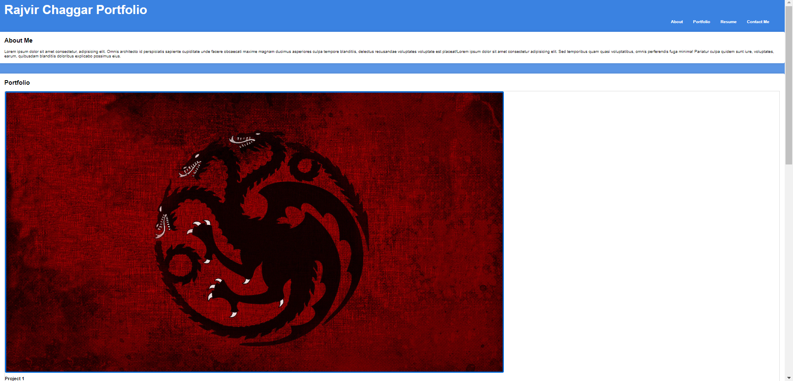

# Portfolio

(* view in open preview*)

This is a portfolio for any future employers. the links that i have attached to the images and to the links section are for websites i do not have my resume and the essential items yet to link to this portfolio for now. once i have my resume and the appropriate links i will attached them. i have added comments explaining my edits in CSS and i have some code commented out as i was attempting to add some different design but wasnt sure if the design looked good. i didnt add comments on my HTML as the page is a standard HTML with images and appropriate syntax elements with a couple divs(i tried article however the code wasnt working)

This is a video of my page. 
<video width="320" height="240" controls>
<source src="Recording-for-Portfolio.mp4" type="video/mp4">
</video>

LINK TO DEPLOYED WEBSITE
https://chaggar25.github.io/Portfolio/

